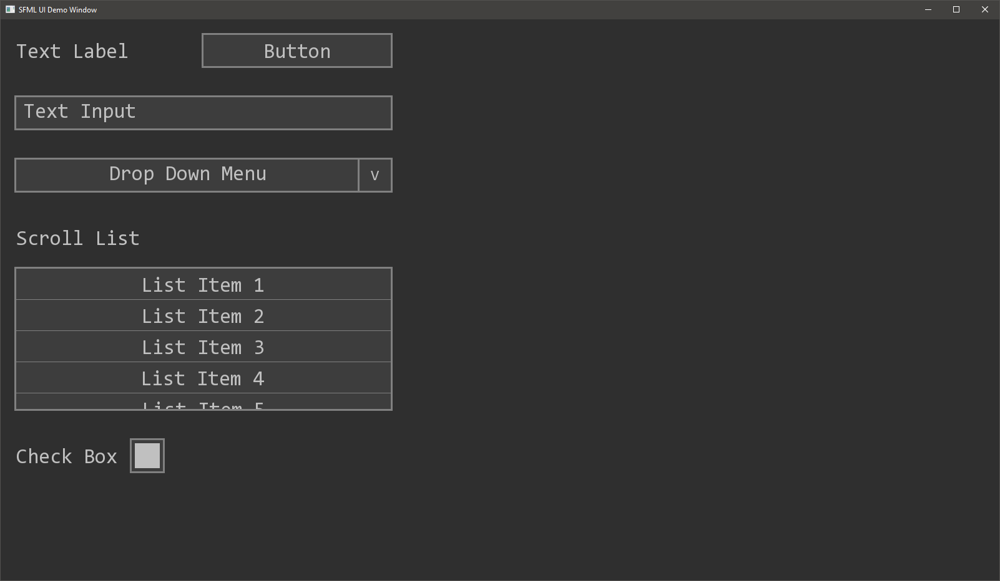

# SFML-GUI

A simple UI Framework based on SFML.

Supported Elements:

 * Text Label
 * Button
 * Drop Down Menu
 * Scroll List (WIP)
 * Check Box
 * Image
 * Animation

## Demo

## Dependencies

[SFML 3.0.0](https://www.sfml-dev.org/download/sfml/3.0.0/)